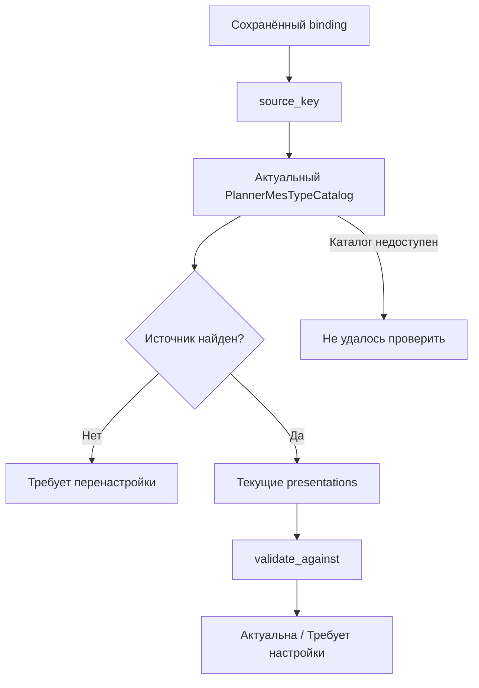

```mermaid
flowchart TD
    A["Сохранённый binding"] --> B["source_key"]
    B --> C["Актуальный PlannerMesTypeCatalog"]
    C --> D{"Источник найден?"}
    D -- "Нет" --> E["Требует перенастройки"]
    D -- "Да" --> F["Текущие presentations"]
    F --> G["validate_against"]
    G --> H["Актуальна / Требует настройки"]
    C -- "Каталог недоступен" --> I["Не удалось проверить"]
```